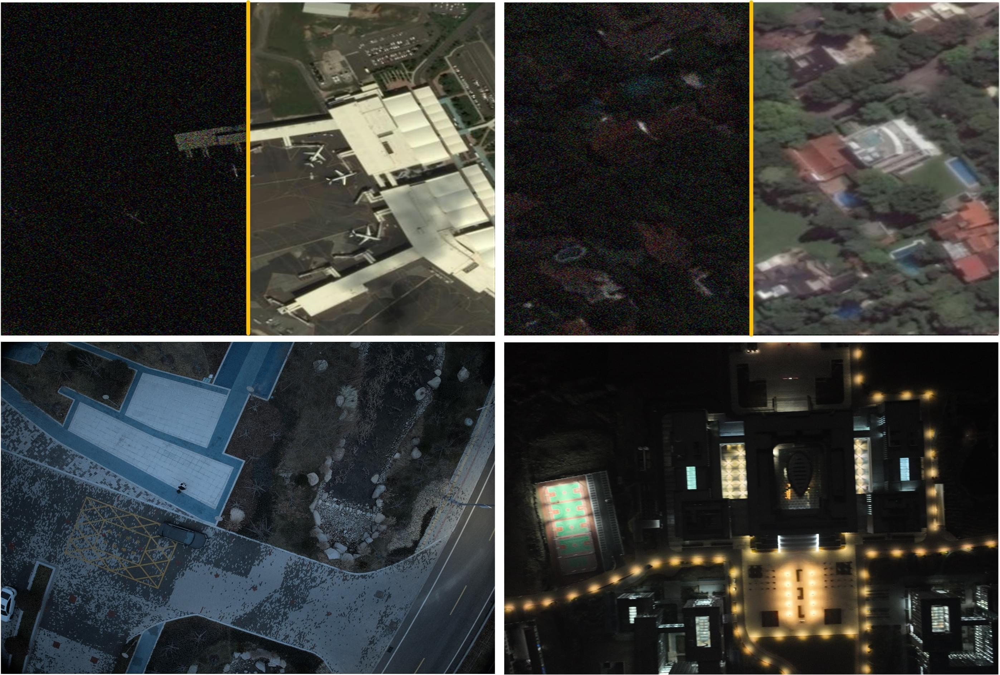
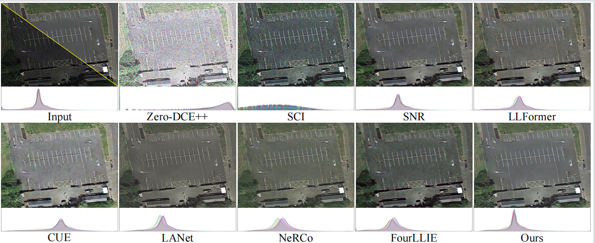

# [Spatial-frequency Dual-Domain Feature Fusion Network for Low-Light Remote Sensing Image  Enhancement]

Official PyTorch implementation of **DFFN**.

    
  Fig. 1. Comparison between the latest state-of-the-art methods and our approach.

## 📑 Content
- [TODO](#todo)
- [Dataset](#data_set)
- [Visual Results](#visual)

## ☑️ TODO
- [x] Build the repo
- [ ] arXiv version
- [ ] Release code
- [ ] Pretrained weights&log_files
- [ ] Add Download Link for Visual Results on Common Benckmarks

## 🔍Dataset
We proposed two datasets iSAID-dark and darkrs. Please click [this link](null) for detailed preparation description. (Coming soon.)

    
  Fig. 2.  Samples from the proposed iSAID-dark(Up) and darkrs(Down) dataset.

## Training & Testing 

###  Coming Soon....

## 🔍Visual Results 

    
  Fig. 3.   The visualization results on the iSAID-dark dataset. We present the histogram of color distribution for the images. The histograms placed in Input/GT
represent the color distribution of the GT. It can be observed that our method’s histogram is closer to the GT histogram.

    
  Fig. 4.   The visualization results on the DICM dataset (top) and the NPE dataset (bottom).

