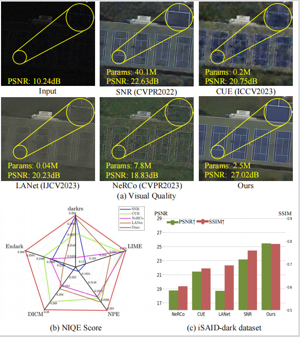

# Spatial-frequency Dual-Domain Feature Fusion Network for Low-Light Remote Sensing Image Enhancement

 <a href='https://arxiv.org/abs/2404.17400'></a>


This repository is an official PyTorch implementation of the paper **Spatial-frequency Dual-Domain Feature Fusion
Network for Low-Light Remote Sensing Image Enhancement**.

<p align="center">
   <br>
  Fig. 1. Comparison between the latest state-of-the-art methods and our approach.
</p>

## 📑 Content
- [TODO](#todo)
- [Dataset](#data_set)
- [Visual Results](#visual)

## <a name='todo'></a>☑️ TODO
- [x] Build the repo
- [x] arXiv version
- [x] Dataset
- [x] Release code
- [x] Pretrained weights&log_files
- [x] Add Download Link for Visual Results on Common Benckmarks

## <a name='data_set'></a>🔍Dataset
We proposed two datasets iSAID-dark and darkrs. Please click [ISAID](https://drive.google.com/file/d/1mlTTdbqG1ZheaWsBcIjAKDyCdbuAqpvy/view?usp=drive_link) and [darkrs](https://drive.google.com/file/d/1XQGpzB9vDGkO7ULnGOF86cyZdqtrX4tI/view?usp=drive_link) for detailed preparation description.
<p align="center">
   <br>
  Fig. 2.  Samples from the proposed iSAID-dark(Up) and darkrs(Down) dataset.
</p>

## Training & Testing 

```js
python test.py
```


## <a name='visual'></a>🔍Visual Results 

<p align="center">
   <br>
  Fig. 3.   The visualization results on the iSAID-dark dataset. We present the histogram of color distribution for the images. The histograms placed in Input/GT
represent the color distribution of the GT. It can be observed that our method’s histogram is closer to the GT histogram.
</p>

<p align="center">
   <br>
  Fig. 4.   The visualization results on the DICM dataset (top) and the NPE dataset (bottom).
</p>


## ✈️ Citation

```bibtex
@article{yao2024spatial,
  title={Spatial-frequency dual-domain feature fusion network for low-light remote sensing image enhancement},
  author={Yao, Zishu and Fan, Guodong and Fan, Jinfu and Gan, Min and Chen, CL Philip},
  journal={IEEE Transactions on Geoscience and Remote Sensing},
  year={2024},
  publisher={IEEE}
}
```